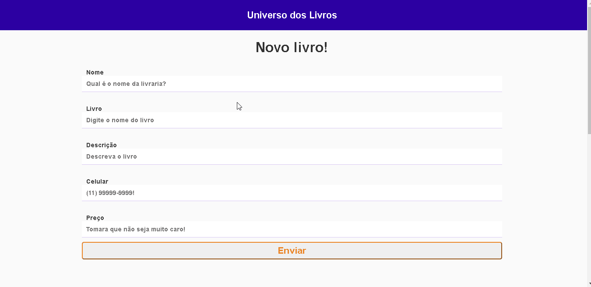

# Livros

## 📸 Screenshots

## 📌 Index

- [Sobre o projeto](#-sobre-o-projeto)
- [Screenshots](#-screenshots)
- [Techs](#-techs)
- [Instalação e Start](#-instalação-e-start)
- [Contribuições](#-contribuições)
- [License](#-license)

## ❔ Sobre o projeto

 Adicionar livros para vender, site que ajuda as pessoas a venderem livros usados e encontar livros com um preço acessível.

## 🛠 Techs

- **Web**
  - [React](https://reactjs.org/)
  - [CSS]()
  - [Mongoose](https://mongoosejs.com/)
  - [Node js](https://nodejs.org/en/)

## ⚙ Instalação e Start

- Faça um npm install no terminal de cada pasta.
- Para executar o backend o comando é npm run dev.
- Já para executar a pasta frontend é npm start

## 🤝 Contribuições

Siga os passos abaixo para contribuir:

1. Faça o *fork* do projeto (<https://github.com/LuanPetruitis/livros>)

2. Clone o seu *fork* para sua maquína (`git clone https://github.com/LuanPetruitis/livros.git`)

3. Crie uma *branch* para realizar sua modificação (`git checkout -b feature/name_new_feature`)

4. Adicione suas modificações e faça o *commit* (`git commit -m "Descreva sua modificação"`)

5. *Push* (`git push origin feature/name_new_feature`)

6. Crie um novo *Pull Request*

7. Pronto, agora só aguardar a análise 🚀 

## 📜 License

O projeto está sobre a licença [MIT](./LICENSE) ❤️ 

Gostou? Deixe uma estrelinha para ajudar o projeto ⭐
